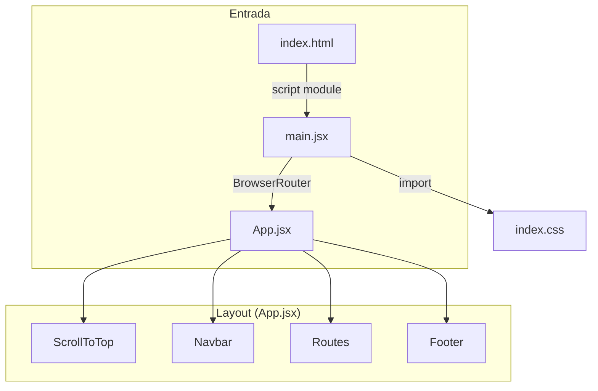
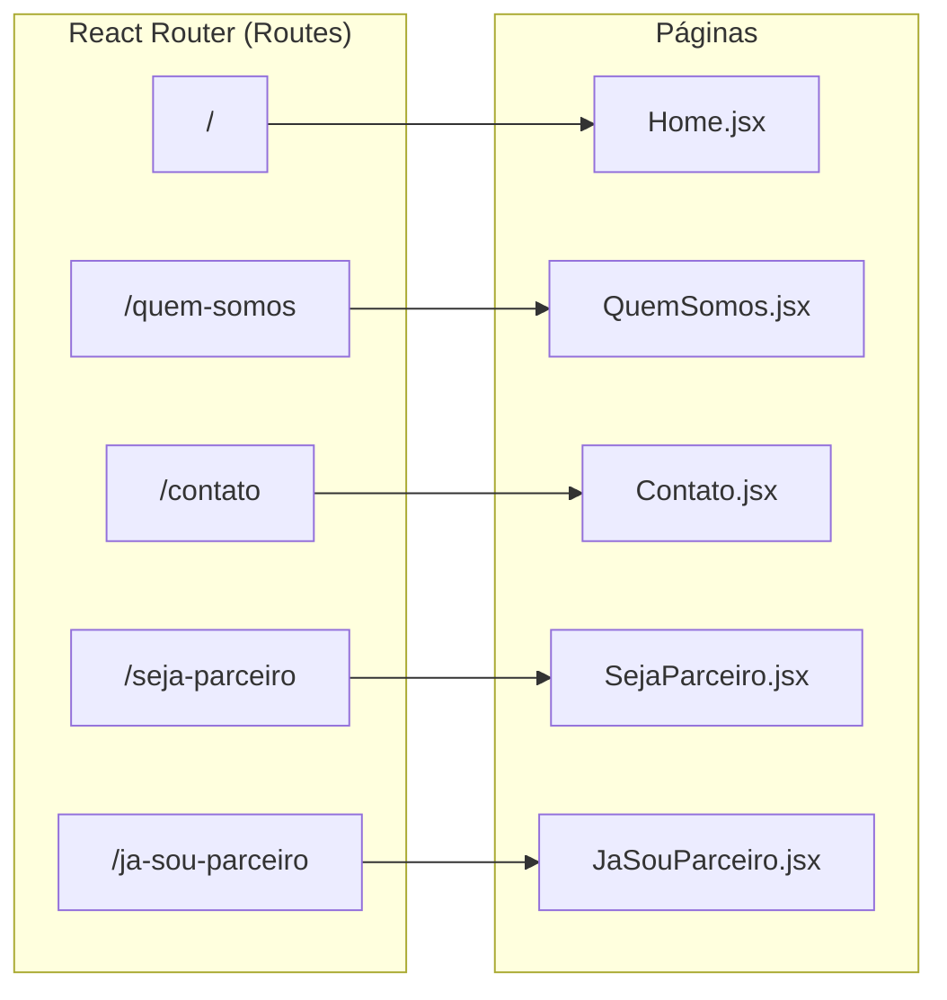
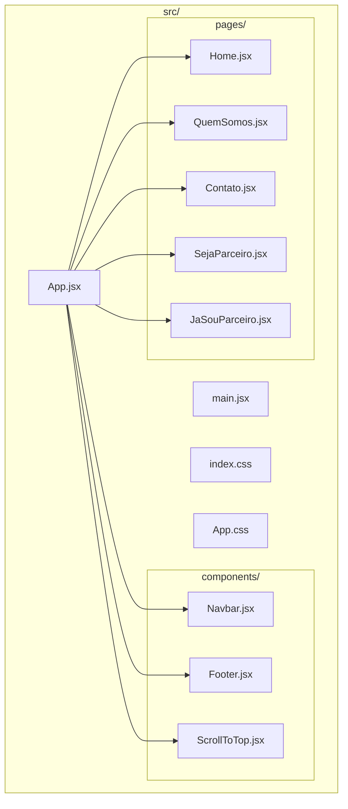
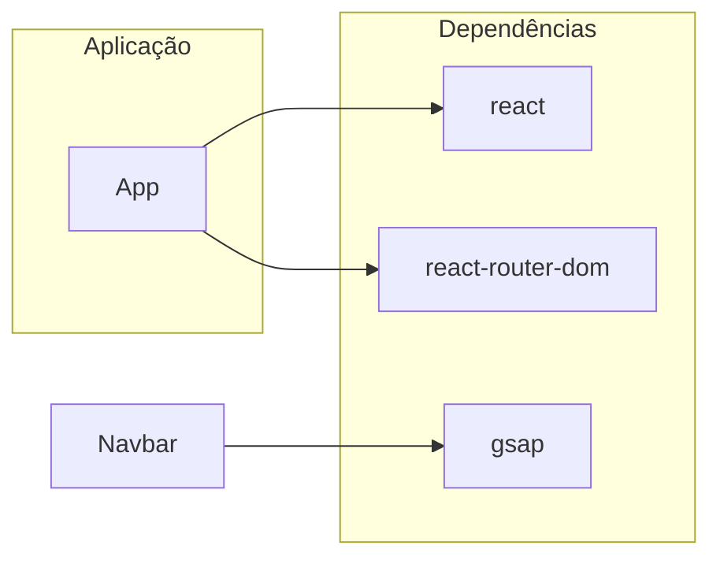
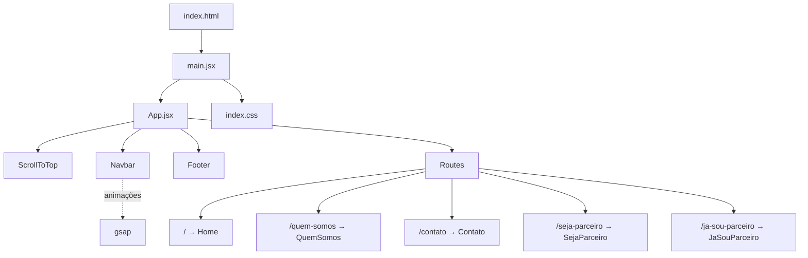

# Center SIM — Diagrama da Codebase

Projeto **React + Vite** para o site da rede Center SIM (segmento construção civil). Abaixo está a arquitetura em diagramas.

---

## 1. Fluxo de entrada e layout

---

## 2. Rotas e páginas

---

## 3. Estrutura de pastas (src)

---

## 4. Dependências principais

| Pacote            | Uso principal                          |
|-------------------|----------------------------------------|
| `react` / `react-dom` | UI e componentes                    |
| `react-router-dom`   | Rotas e navegação                  |
| `gsap`               | Animações (ex.: Navbar)            |
| `vite`               | Build e dev server                 |

---

## 5. Visão geral (um único diagrama)

---

Para visualizar os diagramas Mermaid:
- **VS Code:** extensão "Mermaid" ou "Markdown Preview Mermaid Support"
- **GitHub:** abra este `.md` no repositório
- **Online:** [mermaid.live](https://mermaid.live)
